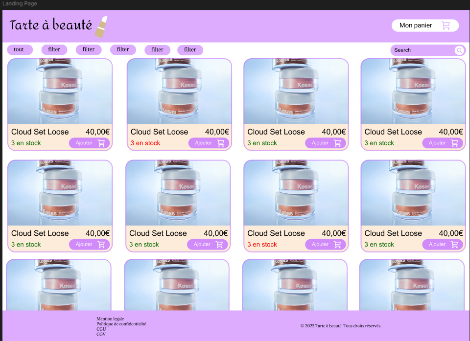
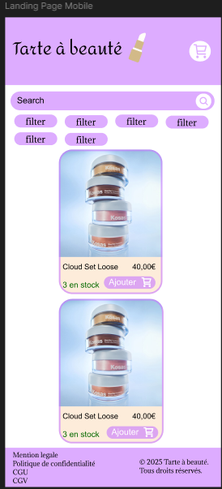
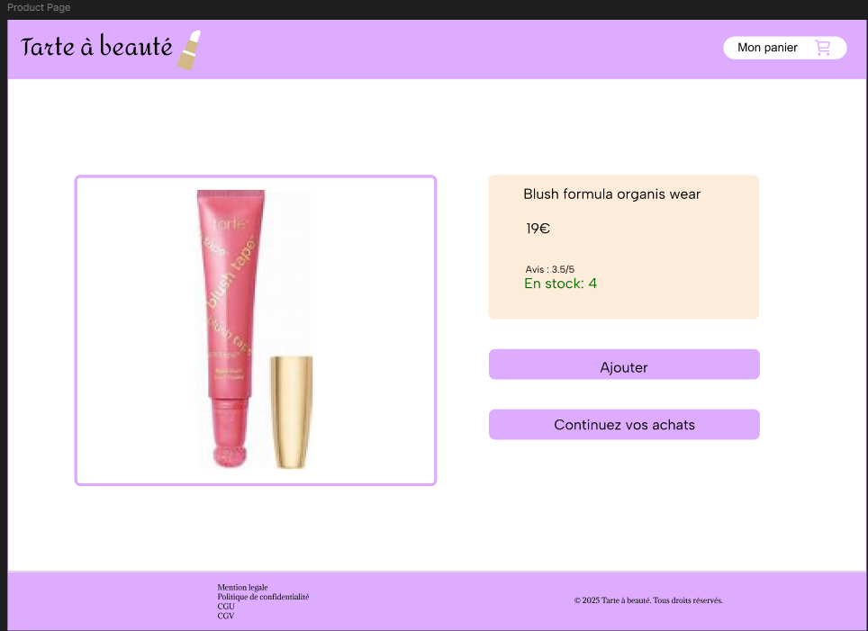
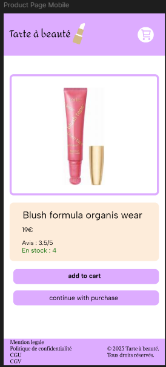
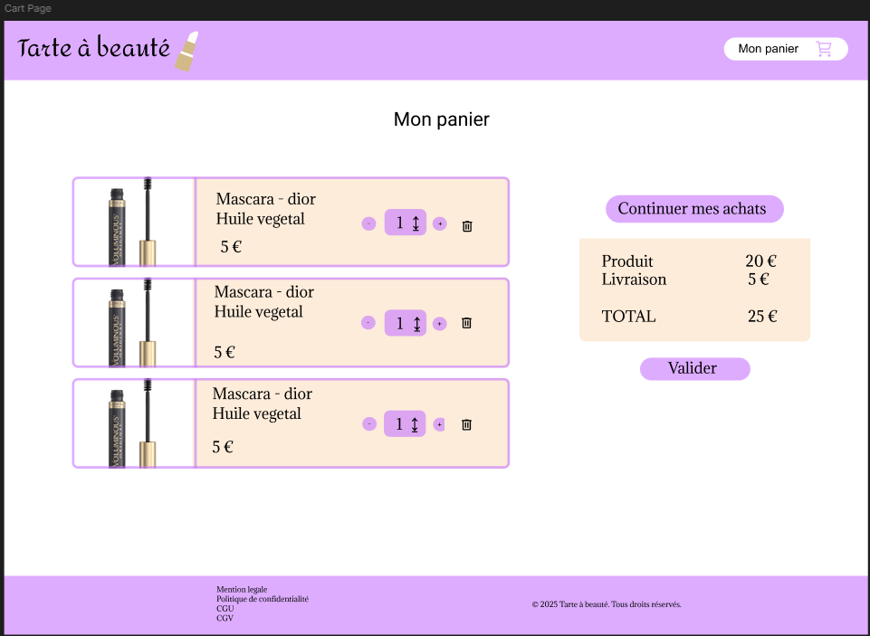
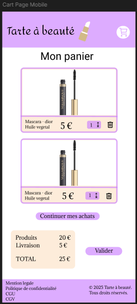
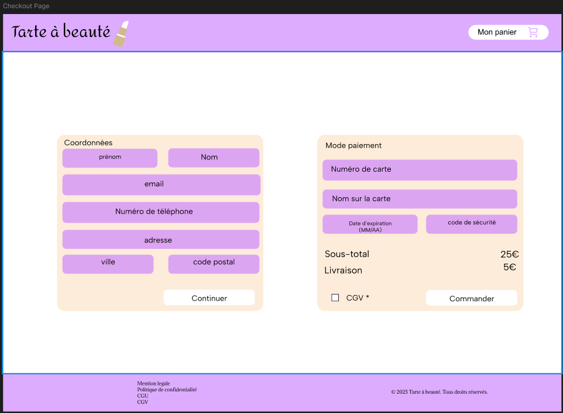
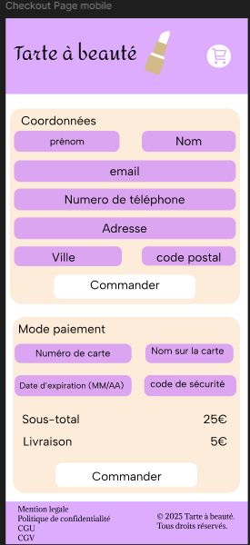
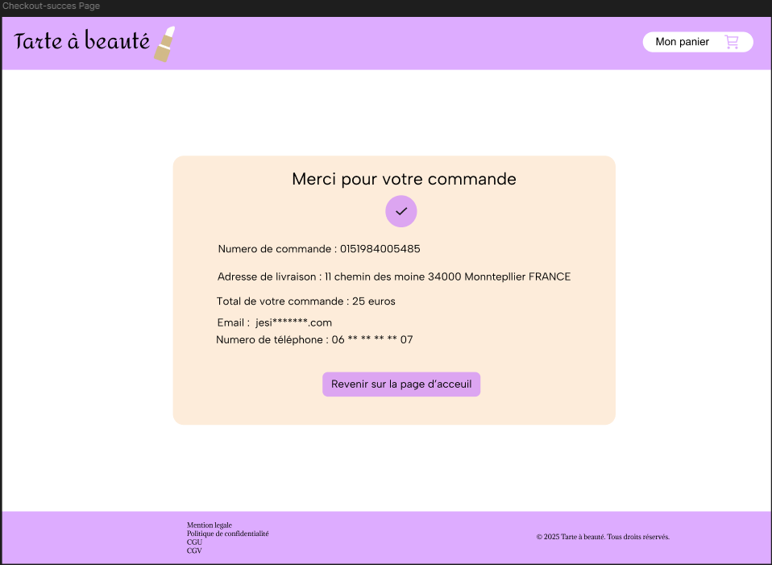
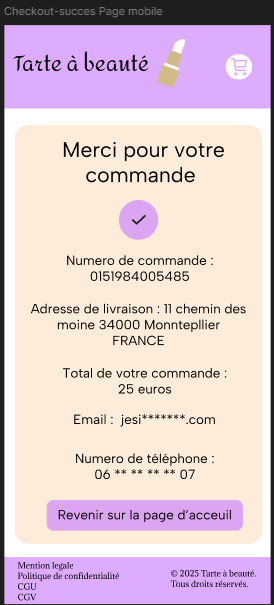

# DOC - Ecommerce Tarte à Beauté

## Tarte à Beauté — Mini E-Commerce Shop

Front-end web development project for a mini cosmetics shop, using HTML, CSS, and Vanilla JavaScript.

---

## Project Name:
**TARTE À BEAUTÉ**

---

## Visual Identity:

- **Color palette:**
  - `#fdecda` (light background)
  - `#c879ff`
  - `#FFFFFF` (white)

- **Font:**
  - *Amita* for headings
  - *Arial* for body text

---

## Data — Cart Structure

```json
[{
  "product": {},
  "numberInCart": 2
}]


Structure cart au format JSON:
[{"product":{},"numberInCart":2}]
The key to store or retrieve from localStorage: "cart"

Script to enter in the console to add fake products for testing
https://pastebin.com/z1yEA0PU


Description:

This project involves creating a mini online shop with a cart and ordering system, following best practices in accessibility, eco-design, and responsive design (mobile-first).

Main features:

-Home page listing products from a JSON file

- Search and filtering by name and category
- Add to cart from the product page
- Interactive cart with quantity management, removal, dynamic total
- 3-step checkout: contact details, delivery, simulated payment
- Data persistence via localStorage
- Responsive & accessible design (keyboard navigation, ARIA, contrast…)

Technologies used

- HTML5 : structure sémantique
- CSS3 : responsive, mobile-first
- JavaScript Vanilla : localStorage
- JSON : simulation d'API produits

Project structure:

/
├── assets/
│   ├── css/
│   │   └── style.css            # Main style file
│   │
│   ├── js/
│   │   ├── shared/
│   │   │   ├── api.js           # Loading products
│   │   │   ├── state.js         # localStorage management
│   │   │   ├── domain.js
│   │   │   └── utils.js         # Utility functions
│   │   │
│   │   └── pages/
│   │       ├── index.js         # JS for the homepage
│   │       ├── product.js       # JS for the productpage
│   │       ├── cart.js          # JS for the cartpage
│   │       └── checkout.js      # JS the checkoutpage
│   │
│   ├── images/                  # logo
│   └── fonts/
│
├── data/
│   └── products.json            # Simulated product data
│
├── docs/                        # Mockups, zoning and wireframe
│
├── cart.html                    # cartpage
├── checkout.html                # checkoutpage
├── index.html                   # homepage
├── product.html                 #  productpage
└── README.md                    # Project documentation


Methodology:

- Work done locally
-Task organization on Trello (Backlog → To Do → In Progress → Done)
- Git: main branch, dev branch, and one branch per feature

Homepage preview:




Product preview:





Cart preview:





Checkout preview:





Checkout success preview:


